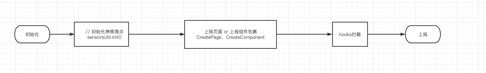

# 神策数据上报

# SDK
 * 当前版本：v1.14.8
 * SDK地址
```
https://github.com/sensorsdata/sa-sdk-miniprogram/releases/tag/v1.14.8
```


# 埋点方案 ： 无埋点方案策略

页面 或 组件 引入 工具类 CreatePage  CreateComponent,

1. 使用改方法创造 Page  或 Component
```
import { CreateComponent } from '../../../../vendors/sensors/utils'

CreateComponent({
  //如果拦截此方法上报
  handleAddCartClick(){},
})


```

2. hooks中定义要拦截的事件名称
```
const hooksFn = function(event){
    console.log('在这里处理 自定义点击事件')
    console.log('事件传值：',event)
    console.log('当前this：',this)
}

export default {
    eventName:'handleAddCartClick',
    hooksFn
}

```
3. 在 hooks  index 中 导出定义的hooks
```
import addCart from './addCart';
 
export default {
    addCart,
}
``` 


# 流程图




    

